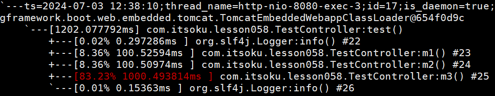

**高并发、微服务 、性能调优实战案例100讲，所有案例均源于个人工作实战，均配合代码落地**

加我微信：itsoku，所有案例均提供在线答疑。


# 第58节 接口响应慢，使用Arthas，3秒定位问题代码

非常实用的一节，先收藏点赞，慢慢看。

<span style="font-weight:bold; color:red">目前整个课程59块钱，100个案例，含所有源码 & 文档 & 技术支持，可点击左下角小黄车了解</span>

# 1、Arthas

arthas：阿里开源的一款Java问题诊断利器，详情见：https://arthas.aliyun.com/doc/quick-start.html


# 2、演示：使用Arthas，快速定位接口慢的代码

## 2.1、案例代码

```java
package com.itsoku.lesson058;

import lombok.extern.slf4j.Slf4j;
import org.springframework.web.bind.annotation.GetMapping;
import org.springframework.web.bind.annotation.RestController;

import java.util.concurrent.TimeUnit;

/**
 * <b>description</b>： Java高并发、微服务、性能优化实战案例100讲，视频号：程序员路人，源码 & 文档 & 技术支持，请加个人微信号：itsoku <br>
 * <b>time</b>：2024/7/3 19:15 <br>
 * <b>author</b>：ready likun_557@163.com
 */
@RestController
@Slf4j
public class TestController {

    @GetMapping("/test")
    public String test() throws InterruptedException {
        log.info("start");
        this.m1();
        this.m2();
        this.m3();
        log.info("end");
        return "ok";
    }

    private void m1() throws InterruptedException {
        //休眠100毫秒
        TimeUnit.MILLISECONDS.sleep(100);
        log.info("m1");
    }

    private void m2() throws InterruptedException {
        //休眠100毫秒
        TimeUnit.MILLISECONDS.sleep(100);
        log.info("m1");
    }

    private void m3() throws InterruptedException {
        //休眠1秒
        TimeUnit.MILLISECONDS.sleep(1000);
        log.info("m1");
    }
}
```


## 2.1、使用Arthas快速定位慢接口代码（5个步骤）

### 1）下载`arthas-boot.jar`

```java
curl -O https://arthas.aliyun.com/arthas-boot.jar
```

### 2）启动`arthas`

```shell
java -jar arthas-boot.jar
```

### 3）选择需要诊断的java进程

```java
[root@iZuf6aaova1ojwh3hg9pnxZ ~]# java -jar arthas-boot.jar
* [1]: 3221212 lesson058-0.0.1-SNAPSHOT.jar
```

> 编号1是咱们需要监控的进程，输入1 便可让arthas监控这个进程

### 4）使用trace命令监控接口详细的耗时情况

> trace命令可以显示指定类和方法内部调用的详细路径，以及每个节点上的耗时情况。
>
> 这对于分析方法执行过程中的性能瓶颈非常有用，尤其是当方法调用链较长或涉及多个层级时

```shell
trace com.itsoku.lesson058.TestController test  -n 5 --skipJDKMethod false 
```



### 5）访问接口，观察第4步trace命令的输出

```http
curl http://localhost:8080/test
```


# 文档获取

需要的小伙伴可以加我微信：itsoku，获取。


# 高并发 & 微服务 & 性能调优实战案例100讲

## 已更新 58 节课

<span style="font-weight:bold; color:red">目前整个课程59块钱，含所有源码 & 文档 & 技术支持，一杯咖啡的价格，还没下手的朋友，赶紧了，马上要涨价了</span>。

```java
1. 分片上传实战
2. 通用并发处理工具类实战
3. 实现一个好用接口性能压测工具类
4. 超卖问题的4种解决方案，也是防止并发修改数据出错的通用方案
5. Semaphore实现接口限流实战
6. 并行查询，优化接口响应速度实战
7. 接口性能优化之大事务优化
8. 通用的Excel动态导出功能实战
9. 手写线程池管理器，管理&监控所有线程池
10. 动态线程池
11. SpringBoot实现动态Job实战
12. 并行查询，性能优化利器，可能有坑
13. 幂等的4种解决方案，吃透幂等性问题
14. 接口通用返回值设计与实现
15. 接口太多，各种dto、vo不计其数，如何命名？
16. 一个业务太复杂了，方法太多，如何传参？
17. 接口报错，如何快速定位日志？
18. 线程数据共享必学的3个工具类：ThreadLocal、InheritableThreadLocal、TransmittableThreadLocal
19. 通过AOP统一打印请求链路日志，排错效率飞升
20. 大批量任务处理常见的方案（模拟余额宝发放收益）
21. 并发环境下，如何验证代码是否正常？
22. MySql和Redis数据一致性
23. SpringBoot数据脱敏优雅设计与实现
24. 一行代码搞定系统操作日志
25. Aop简化MyBatis分页功能
26. ThreadLocal 遇到线程池有大坑 & 通用解决方案
27. SpringBoot读写分离实战（一个注解搞定读写分离 && 强制路由主库）
28. MQ专题-MQ典型的使用场景
29. MQ专题-如何确保消息的可靠性
30. MQ专题-SpringBoot中，手把手教你实现事务消息
31. 手写一个好用的延迟任务处理工具类
32. MQ专题-MQ延迟消息通用方案实战
33. MQ消息幂等消费 & 消费失败衰减式重试通用方案 & 代码 & 文档
34. MQ专题：顺序消息通用方案实战 & 代码落地 & 文档
35. MQ专题：消息积压相关问题及解决思路
36. 分布式事务-MQ最终一致性-实现跨库转账（案例+源码+文档）
37. 分布式事务-MQ最终一致性-实现电商账户余额提现到微信钱包（案例+源码+文档）
38. 分布式事务：通用的TCC分布式事务生产级代码落地实战
39. 分布式锁详解
40. 分享一个特别好用的Redissson分布式锁工具类
41. 一个注解轻松搞定分布式锁
42. 微服务中如何传递公共参数？
43. 接口幂等，通用方案 & 代码落地
44. 微服务链路日志追踪实战
45. 接口测试利器HTTP Client，不用Postman也可以
46. 封装MyBatis，实现通用无SQL版CRUD功能ORM框架
47. MyBatisPlus 轻松实现多租户数据隔离
48. 电商系统-资金账户表设计 及 应用实战
49. UML画图神器：PlantUML，画图效率飞升
50. 多线程事务，3秒插入百万数据
51. SpringBoot中自动初始化数据库功能，非常好用
52. SpringBoot优雅停机
53. 分享一个特好用的集合工具类，开发效率轻松翻倍
54. 性能调优：线程死锁相关问题
55. 如何排查OOM？
56. cpu飙升，如何快速排查？
57. cpu飙升，使用Arthas，3秒定位问题
58. 接口响应慢，使用Arthas，3秒定位问题代码
```


## 课程部分大纲，连载中。。。。

以下课程均来源于个人多年的实战，均提供原理讲解 && 源码落地

1. 分片上传实战
2. 通用并发处理工具类实战
3. 实现一个好用接口性能压测工具类
4. 超卖问题的4种解决方案，也是防止并发修改数据出错的通用方案
5. Semaphore实现接口限流实战
6. 并行查询，优化接口响应速度实战
7. 接口性能优化之大事务优化
8. 通用的Excel动态导出功能实战
9. 手写线程池管理器，管理&监控所有线程池
10. 动态线程池
11. SpringBoot实现动态Job实战
12. 并行查询，性能优化利器，可能有坑
13. 幂等的4种解决方案，吃透幂等性问题
14. 接口通用返回值设计与实现
15. 接口太多，各种dto、vo不计其数，如何命名？
16. 一个业务太复杂了，方法太多，如何传参？
17. 接口报错，如何快速定位日志？
18. 线程数据共享必学的3个工具类：ThreadLocal、InheritableThreadLocal、TransmittableThreadLocal
19. 通过AOP统一打印请求链路日志，排错效率飞升
20. 大批量任务处理常见的方案（模拟余额宝发放收益）
21. 并发环境下，如何验证代码是否正常？
22. MySql和Redis数据一致性
23. SpringBoot数据脱敏优雅设计与实现
24. 一行代码搞定系统操作日志
25. Aop简化MyBatis分页功能
26. ThreadLocal 遇到线程池有大坑 & 通用解决方案
27. SpringBoot读写分离实战（一个注解搞定读写分离 && 强制路由主库）
28. MQ专题：MQ典型的7种使用场景
29. MQ专题：如何确保消息的可靠性
30. MQ专题：SpringBoot中，手把手教你实现事务消息
31. 手写一个好用的延迟任务处理工具类
32. MQ专题：延迟消息通用方案实战
33. MQ专题：消息幂等消费 & 消费失败自动重试通用方案 & 代码落地
34. MQ专题：顺序消息通用方案实战
35. MQ专题：消息积压问题
36. 分布式事务-MQ最终一致性-实现跨库转账（案例+源码+文档）
37. 分布式事务-MQ最终一致性-实现电商账户余额提现到微信钱包（案例+源码+文档）
38. 分布式事务：通用的TCC分布式事务生产级代码落地实战
39. 分布式锁详解
40. 分享一个特别好用的Redissson分布式锁工具类
41. 分布式锁：一个注解轻松实现布式锁
42. 微服务中如何传递上下文？实战
43. 接口幂等，通用方案 & 代码落地
44. 微服务链路日志追踪实战
45. 接口测试利器HTTP Client，不用Postman也可以
46. 封装MyBatis，实现通用无SQL版CRUD功能
47. MyBatisPlus 轻松实现 多租户数据隔离
48. 电商系统-资金账户表设计 及 应用实战
49. 开发者必须掌握的一款UML画图工具，画图效率飞升
50. 多线程事务，3秒插入百万数据
51. SpringBoot自动初始化数据库功能，太好用了
52. SpringBoot优雅停机
53. 分享一个特别好用的集合工具类，开发效率大幅提升
54. 性能调优：如何排查死锁？
55. 如何排查OOM？
56. cpu飙升，如何快速排查？
58. cpu飙升，使用Arthas，3秒定位问题
58. 接口响应慢，使用Arthas，3秒定位问题代码
59. 如何查看生产上接口的入参和返回值？
60. 远程debug
61. 生产上出现了各种故障，如何定位？
62. db和缓存一致性，常见的方案
63. Redis场景案例。。。
64. 系统资金账户设计案例（一些系统涉及到资金操作）
65. 工作中常见的场景案例设计与实现。。。

