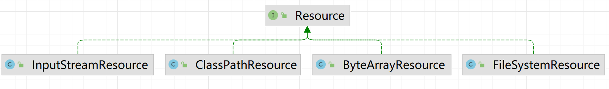

**高并发、微服务 、性能调优实战案例100讲，所有案例均源于个人工作实战，均配合代码落地**

加我微信：<span style="font-weight:bold; color:red">itsoku</span>，所有案例均提供在线答疑。


# 第82节 SpringBoot下载文件的几种方式，一次性搞懂

非常实用的一节，先收藏点赞，慢慢看。

<span style="font-weight:bold; color:red">目前整个课程59块钱，100个案例，含所有源码 & 文档 & 技术支持，可点击左下角小黄车了解</span>


# 1、前言

文件下载，常用的一个功能，比较简单

但是有可能会遇到一些问题

1. 文件太大，若写法上有问题，可能会导致内存溢出

2. 文件中文名称乱码问题

本文将给大家展示SpringBoot中下载文件常见的几种方式，顺便解决这些问题。


# 2、小文件下载

## 2.1、方式1：HttpServletResponse.write

代码如下，直接将文件一次性读取到内存中，然后通过response将文件内容输出到客户端，这种方式适合小文件，若文件比较大的时候，将文件一次性加载到内存中会导致OOM，这点需要注意

```java
@GetMapping("/download1")
public void download1(HttpServletResponse response) throws IOException {
    // 指定要下载的文件
    File file = ResourceUtils.getFile("classpath:文件1.txt");
    // 文件转成字节数组
    byte[] fileBytes = Files.readAllBytes(file.toPath());
    //文件名编码，防止中文乱码
    String filename = URLEncoder.encode(file.getName(), "UTF-8");
    // 设置响应头信息
    response.setHeader("Content-Disposition", "attachment; filename=\"" + filename + "\"");
    // 内容类型为通用类型，表示二进制数据流
    response.setContentType("application/octet-stream");
    //输出文件内容
    try (OutputStream os = response.getOutputStream()) {
        os.write(fileBytes);
    }
}
```

> 乱码的解决，主要靠下面这几行代码
>
> ```java
> //文件名编码，防止中文乱码
> String filename = URLEncoder.encode(file.getName(), "UTF-8");
> // 设置响应头信息
> response.setHeader("Content-Disposition", "attachment; filename=\"" + filename + "\"");
> ```

启动系统，看下效果，浏览器中访问：http://localhost:8080/download1

## 2.2、方式2：ResponseEntity&lt;byte[]&gt;

代码如下，方法需要返回`ResponseEntity`类型的对象，这个类是SpringBoot中自带的，是对http响应结果的一种封装，可以用来构建http响应结果：包含状态码、头、响应体等信息。

```java
@GetMapping("/download2")
public ResponseEntity<byte[]> download2() throws IOException {
    // 指定要下载的文件
    File file = ResourceUtils.getFile("classpath:文件1.txt");
    // 文件转成字节数组
    byte[] fileBytes = Files.readAllBytes(file.toPath());
    //文件名编码，防止中文乱码
    String filename = URLEncoder.encode(file.getName(), "UTF-8");
    //构建响应实体：ResponseEntity，ResponseEntity中包含了http请求的响应信息，比如状态码、头、body
    ResponseEntity<byte[]> responseEntity = ResponseEntity.ok()
            .header(HttpHeaders.CONTENT_DISPOSITION, "attachment; filename=\"" + filename + "\"")
            .header(HttpHeaders.CONTENT_TYPE, MediaType.APPLICATION_OCTET_STREAM_VALUE)
            .body(fileBytes);
    return responseEntity;
}
```

看下效果，浏览器中访问：http://localhost:8080/download2

上面的2种方式，都是先将文件读取到字节数组，然后再返回给客户端，如果文件太大，将文件内容读取到内存，可能会导致oom。

所以，上面2种方式，大家了解就行了，不建议使用。


# 3、通用方案（适合任何大小文件），建议采用

## 2.1、方式1：边读取+边输出

```java
@GetMapping("/download3")
public void download3(HttpServletResponse response) throws IOException {
    // 指定要下载的文件
    File file = ResourceUtils.getFile("classpath:文件1.txt");
    //文件名编码，防止中文乱码
    String filename = URLEncoder.encode(file.getName(), "UTF-8");
    // 设置响应头信息
    response.setHeader("Content-Disposition", "attachment; filename=\"" + filename + "\"");
    // 内容类型为通用类型，表示二进制数据流
    response.setContentType("application/octet-stream");
    // 循环，边读取边输出，可避免大文件时OOM
    try (InputStream inputStream = new FileInputStream(file);
         OutputStream os = response.getOutputStream()) {
        byte[] bytes = new byte[1024];
        int readLength;
        while ((readLength = inputStream.read(bytes)) != -1) {
            os.write(bytes, 0, readLength);
        }
    }
}
```

看下效果，浏览器中访问：http://localhost:8080/download3

## 2.3、方式2：返回 ResponseEntity&lt;Resource&gt;

```java
@GetMapping("/download4")
public ResponseEntity<Resource> download4() throws IOException {
    /**
     * 通过 ResponseEntity 下载文件，body 为 org.springframework.core.io.Resource 类型
     * Resource是spring中的一个资源接口，是对资源的一种抽象，常见的几个实现类
     * ClassPathResource：classpath下面的文件资源
     * FileSystemResource：文件系统资源
     * InputStreamResource：流资源
     * ByteArrayResource：字节数组资源
     */
    Resource resource = new ClassPathResource("文件1.txt");
    //文件名编码，防止中文乱码
    String filename = URLEncoder.encode("文件1.txt", "UTF-8");
    //构建响应实体：ResponseEntity，ResponseEntity中包含了http请求的响应信息，比如状态码、头、body
    ResponseEntity<Resource> responseEntity = ResponseEntity.ok()
            .header(HttpHeaders.CONTENT_DISPOSITION, "attachment; filename=\"" + filename + "\"")
            .header(HttpHeaders.CONTENT_TYPE, MediaType.APPLICATION_OCTET_STREAM_VALUE)
            .body(resource);
    return responseEntity;
}
```



看下效果，浏览器中访问：http://localhost:8080/download4


# 4、中文乱码

有些朋友可能遇到过，文件名中如果有中文，下载下来后文件名称是乱码

解决代码如下，需要对文件名称进行编码，具体大家可以看看上面的案例代码。

```java
//文件名编码，防止中文乱码
String filename = URLEncoder.encode(file.getName(), "UTF-8");
```


# 5、案例完整代码

源码在 lesson082 这个模块中，上面接口代码都在下面这个controller中

```java
com.itsoku.lesson082.FileController
```


# 6、获取，源码 & 文档 & 技术支持

需要的小伙伴可以加我微信：itsoku，获取。


# 高并发 & 微服务 & 性能调优实战案例100讲

## 已更新 82 节课

<span style="font-weight:bold; color:red">目前整个课程59块钱，含所有源码 & 文档 & 技术支持，一杯咖啡的价格，还没下手的朋友，赶紧了</span>。

```java
1. 分片上传实战
2. 通用并发处理工具类实战
3. 实现一个好用接口性能压测工具类
4. 超卖问题的4种解决方案，也是防止并发修改数据出错的通用方案
5. Semaphore实现接口限流实战
6. 并行查询，优化接口响应速度实战
7. 接口性能优化之大事务优化
8. 通用的Excel动态导出功能实战
9. 手写线程池管理器，管理&监控所有线程池
10. 动态线程池
11. SpringBoot实现动态Job实战
12. 并行查询，性能优化利器，可能有坑
13. 幂等的4种解决方案，吃透幂等性问题
14. 接口通用返回值设计与实现
15. 接口太多，各种dto、vo不计其数，如何命名？
16. 一个业务太复杂了，方法太多，如何传参？
17. 接口报错，如何快速定位日志？
18. 线程数据共享必学的3个工具类：ThreadLocal、InheritableThreadLocal、TransmittableThreadLocal
19. 通过AOP统一打印请求链路日志，排错效率飞升
20. 大批量任务处理常见的方案（模拟余额宝发放收益）
21. 并发环境下，如何验证代码是否正常？
22. MySql和Redis数据一致性
23. SpringBoot数据脱敏优雅设计与实现
24. 一行代码搞定系统操作日志
25. Aop简化MyBatis分页功能
26. ThreadLocal 遇到线程池有大坑 & 通用解决方案
27. SpringBoot读写分离实战（一个注解搞定读写分离 && 强制路由主库）
28. MQ专题-MQ典型的使用场景
29. MQ专题-如何确保消息的可靠性
30. MQ专题-SpringBoot中，手把手教你实现事务消息
31. 手写一个好用的延迟任务处理工具类
32. MQ专题-MQ延迟消息通用方案实战
33. MQ消息幂等消费 & 消费失败衰减式重试通用方案 & 代码 & 文档
34. MQ专题：顺序消息通用方案实战 & 代码落地 & 文档
35. MQ专题：消息积压相关问题及解决思路
36. 分布式事务-MQ最终一致性-实现跨库转账（案例+源码+文档）
37. 分布式事务-MQ最终一致性-实现电商账户余额提现到微信钱包（案例+源码+文档）
38. 分布式事务：通用的TCC分布式事务生产级代码落地实战
39. 分布式锁详解
40. 分享一个特别好用的Redissson分布式锁工具类
41. 一个注解轻松搞定分布式锁
42. 微服务中如何传递公共参数？
43. 接口幂等，通用方案 & 代码落地
44. 微服务链路日志追踪实战
45. 接口测试利器HTTP Client，不用Postman也可以
46. 封装MyBatis，实现通用无SQL版CRUD功能ORM框架
47. MyBatisPlus 轻松实现多租户数据隔离
48. 电商系统-资金账户表设计 及 应用实战
49. UML画图神器：PlantUML，画图效率飞升
50. 多线程事务，3秒插入百万数据
51. SpringBoot中自动初始化数据库功能，非常好用
52. SpringBoot优雅停机
53. 分享一个特好用的集合工具类，开发效率轻松翻倍
54. 性能调优：线程死锁相关问题
55. 如何排查OOM？
56. cpu飙升，如何快速排查？
57. cpu飙升，使用Arthas，3秒定位问题
58. 接口响应慢，使用Arthas，3秒定位问题代码
59. 策略模式，轻松消除ifelse代码
60. 生产上，代码未生效，如何排查？
61. 使用MySQL，实现一个高性能，分布式id生成器
62. 方法执行异常，使用arthas，快速定位问题
63. 扫码登录详解
64. 使用hutool生成&解析二维码，太方便了
65. SpringBoot中，redis中实现排行榜
66. SpringBoot中，Redis如何实现查找附近的人功能？
67. SpringBoot中，接口签名，通用方案，一次性搞懂
68. SpringBoot中，接口加解密，通用方案实战
69. 分库、分表、分库分表，如何选择？
70. 分库分表：分表字段如何选择？
71. 分库分表：分表数量为什么建议是2的n次方？
72. 分库分表：如何平滑迁移数据？
73. 并发编程有多难？值得反复研究的一个案例
74. 使用Redis Pipeline，接口性能提升10倍
75. 电商中，重复支付如何解决？
76. 千万级数据，全表update的正确姿势
77. 优雅实现树形菜单，适用于所有树，太好用了
78. 接口调用利器：RestTemplate，吃透它
79. 微服务跨库查询，如何解决？一次性搞懂
80. 逻辑删除与唯一约束冲突，如何解决？
81. 评论系统如何设计，一次性给你讲清楚
82. SpringBoot下载文件的几种方式，一次性搞懂
```


## 课程部分大纲，连载中。。。。

以下课程均来源于个人多年的实战，均提供原理讲解 && 源码落地

1. 分片上传实战
2. 通用并发处理工具类实战
3. 实现一个好用接口性能压测工具类
4. 超卖问题的4种解决方案，也是防止并发修改数据出错的通用方案
5. Semaphore实现接口限流实战
6. 并行查询，优化接口响应速度实战
7. 接口性能优化之大事务优化
8. 通用的Excel动态导出功能实战
9. 手写线程池管理器，管理&监控所有线程池
10. 动态线程池
11. SpringBoot实现动态Job实战
12. 并行查询，性能优化利器，可能有坑
13. 幂等的4种解决方案，吃透幂等性问题
14. 接口通用返回值设计与实现
15. 接口太多，各种dto、vo不计其数，如何命名？
16. 一个业务太复杂了，方法太多，如何传参？
17. 接口报错，如何快速定位日志？
18. 线程数据共享必学的3个工具类：ThreadLocal、InheritableThreadLocal、TransmittableThreadLocal
19. 通过AOP统一打印请求链路日志，排错效率飞升
20. 大批量任务处理常见的方案（模拟余额宝发放收益）
21. 并发环境下，如何验证代码是否正常？
22. MySql和Redis数据一致性
23. SpringBoot数据脱敏优雅设计与实现
24. 一行代码搞定系统操作日志
25. Aop简化MyBatis分页功能
26. ThreadLocal 遇到线程池有大坑 & 通用解决方案
27. SpringBoot读写分离实战（一个注解搞定读写分离 && 强制路由主库）
28. MQ专题：MQ典型的7种使用场景
29. MQ专题：如何确保消息的可靠性
30. MQ专题：SpringBoot中，手把手教你实现事务消息
31. 手写一个好用的延迟任务处理工具类
32. MQ专题：延迟消息通用方案实战
33. MQ专题：消息幂等消费 & 消费失败自动重试通用方案 & 代码落地
34. MQ专题：顺序消息通用方案实战
35. MQ专题：消息积压问题
36. 分布式事务-MQ最终一致性-实现跨库转账（案例+源码+文档）
37. 分布式事务-MQ最终一致性-实现电商账户余额提现到微信钱包（案例+源码+文档）
38. 分布式事务：通用的TCC分布式事务生产级代码落地实战
39. 分布式锁详解
40. 分享一个特别好用的Redissson分布式锁工具类
41. 分布式锁：一个注解轻松实现布式锁
42. 微服务中如何传递上下文？实战
43. 接口幂等，通用方案 & 代码落地
44. 微服务链路日志追踪实战
45. 接口测试利器HTTP Client，不用Postman也可以
46. 封装MyBatis，实现通用无SQL版CRUD功能
47. MyBatisPlus 轻松实现 多租户数据隔离
48. 电商系统-资金账户表设计 及 应用实战
49. 开发者必须掌握的一款UML画图工具，画图效率飞升
50. 多线程事务，3秒插入百万数据
51. SpringBoot自动初始化数据库功能，太好用了
52. SpringBoot优雅停机
53. 分享一个特别好用的集合工具类，开发效率大幅提升
54. 性能调优：如何排查死锁？
55. 如何排查OOM？
56. cpu飙升，如何快速排查？
57. cpu飙升，使用Arthas，3秒定位问题
58. 接口响应慢，使用Arthas，3秒定位问题代码
59. 策略模式，轻松消除ifelse代码
60. 生产上，代码未生效，如何排查？
61. 使用MySQL，实现一个高性能，分布式id生成器
62. 方法执行异常，使用arthas，快速定位问题
63. 扫码登录详解
64. 使用hutool生成&解析二维码，太方便了
65. SpringBoot中，Redis如何实现排行榜功能？
66. SpringBoot中，Redis如何实现查找附近的人功能？
67. SpringBoot中，接口签名，通用方案，一次性搞懂
68. SpringBoot中，接口加解密，通用方案实战
69. 分库、分表、分库分表，如何选择？
70. 分库分表：分表字段如何选择？
71. 分库分表：分表数量为什么建议是2的n次方？
72. 分库分表：如何平滑迁移数据？
73. 并发编程有多难？值得反复研究的一个案例
74. 使用Redis Pipeline，接口性能提升10倍
75. 电商系统中，如何解决重复支付？
76. 千万级数据，全表update的正确姿势
77. 优雅实现树形菜单，适用于所有树，太好用了
78. 接口调用利器：RestTemplate，太好用了，吃透它
79. 微服务跨库查询，如何解决？
80. 逻辑删除与唯一约束冲突，如何解决？
81. 评论系统如何设计，一次性给你讲清楚
82. SpringBoot下载文件的几种方式，一次性搞懂
83. 更多实战案例详解