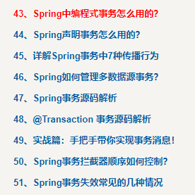

**高并发、微服务 、性能调优实战案例100讲，所有案例均源于个人工作实战，均配合代码落地**

加我微信：<span style="font-weight:bold; color:red">itsoku</span>，所有案例均提供在线答疑。


# 第90节 Spring事务失效，常见的几种场景，带你精通Spring事务

非常实用的一节，先收藏点赞，慢慢看。

<span style="font-weight:bold; color:red">目前整个课程59块钱，100个案例，含所有源码 & 文档 & 技术支持，可点击左下角小黄车了解</span>


# 1、本文主要3块内容

1. Spring事务失效常见的4种场景
2. 事务失效问题如何排查？

3. 如何精通Spring事务？


# 2、事务失效场景1：通过this调用自身@Transactional方法

## 案例代码

如下代码，外部调用m1方法，m1方法中调用m2方法，虽然m2方法上加了事务@Transactional注解，但是事务不会生效

```java
@Service
public class UserService {
    @Autowired
    private UserMapper userMapper;

    public void m1() {
        this.m2("1", "m1");
    }

    @Transactional
    public void m2(String id, String name) {
        //向用户表插入一条记录
        UserPO userPO = new UserPO();
        userPO.setId(id);
        userPO.setName(name);
        this.userMapper.insert(userPO);

        //抛出异常，看看事务是否会回滚
        throw new RuntimeException("故意失败，看下事务是否会回滚");
    }

}
```

运行看下效果，虽然报异常了，但是数据插入成功了。


## 原因

Spring中的@Transactional事务，是通过aop生成代理对象实现的，所以通过代理对象访问目标方法的时候，事务才会起效。

而上面的m1方法中通过this调用的m2方法，而this并不是代理对象，所以事务是无效的。

**解决方案，这里给大家介绍3种。**


## 解决方案1：注入了自己

```java
@Service
public class UserService {

    //注入自己，articleService就是被AOP包装后的代理对象
    @Autowired
    private UserService userService;

    public void m3() {
        //通过userService访问m2，事务会生效
        this.userService.m2("3", "m3");
    }
    
    @Transactional
    public void m2(String id, String name) {
        //向用户表插入一条记录
        UserPO userPO = new UserPO();
        userPO.setId(id);
        userPO.setName(name);
        this.userMapper.insert(userPO);

        //抛出异常，看看事务是否会回滚
        throw new RuntimeException("故意失败，看下事务是否会回滚");
    }

}
```


## 解决方案2：编程式事务

```java
@Service
public class UserService {

    @Autowired
    private TransactionTemplate transactionTemplate;

    public void m4() {
        this.transactionTemplate.executeWithoutResult(action -> {
            this.m2("4", "m4");
        });
    }
    
    @Transactional
    public void m2(String id, String name) {
        //向用户表插入一条记录
        UserPO userPO = new UserPO();
        userPO.setId(id);
        userPO.setName(name);
        this.userMapper.insert(userPO);

        //抛出异常，看看事务是否会回滚
        throw new RuntimeException("故意失败，看下事务是否会回滚");
    }

}
```


## 解决方案3：AopContext.currentProxy()

```java
@Service
public class UserService {

    public void m5() {
        //通过Spring提供的工具类AopContext.currentProxy()，可以获取当前代理对象，将类型强制转换为UserService，然后调用m2方法，事务也会生效
        UserService as = (UserService) AopContext.currentProxy();
        as.m2("5", "m5");
    }
    
    @Transactional
    public void m2(String id, String name) {
        //向用户表插入一条记录
        UserPO userPO = new UserPO();
        userPO.setId(id);
        userPO.setName(name);
        this.userMapper.insert(userPO);

        //抛出异常，看看事务是否会回滚
        throw new RuntimeException("故意失败，看下事务是否会回滚");
    }

}
```


# 3、事务失效场景2：异常类型不匹配

Spring事务回滚的机制：会拦截@Transactional标注的方法，当方法抛出指定的异常时，被Spring捕获到了，事务才会进行回滚。

那么问题来了，哪些异常spring会回滚事务呢？

并不是任何异常Spring都会回滚事务，默认情况下，RuntimeException和Error的情况下，spring事务才会回滚。

也可以通过@Transactional中的rollbackFor属性指定要回滚的异常类型：

```java
@Transactional(rollbackFor = {异常类型列表})
```

当方法抛出的异常是这些异常、或者是这些异常的子类的时候，事务才会回滚。

比如下面这个案例代码，rollbackFor指定的是 `RuntimeException`异常，而方法内部抛出的是 `Exception`异常，不符合上面的条件，所以事务不会回滚。

```java
@Transactional(rollbackFor = RuntimeException.class)
public void m6() throws Exception {
    //向用户表插入一条记录
    UserPO userPO = new UserPO();
    userPO.setId("6");
    userPO.setName("m6");
    this.userMapper.insert(userPO);

    //抛出一个Exception异常，看看事务是否会回滚
    throw new Exception("抛出Exception异常");
}
```

运行看下效果，确实没有回滚。


# 4、事务失效场景3：异常被吞了

当业务方法抛出异常，spring感知到异常的时候，才会做事务回滚的操作，若方法内部将异常给吞了，那么spring事务无法感知到异常了，事务就不会回滚了。

如下代码，发生了异常，但是被捕获了，spring无法感知到异常，此时事务并不会被回滚

```java
@Transactional(rollbackFor = Exception.class)
public void m7() throws Exception {
    try {
        //向用户表插入一条记录
        UserPO userPO = new UserPO();
        userPO.setId("7");
        userPO.setName("m7");
        this.userMapper.insert(userPO);

        //抛出一个Exception异常，
        throw new RuntimeException("抛出Exception异常");
    } catch (Exception e) {
        e.printStackTrace();
    }
}
```


# 5、事务失效场景4：不同的线程事务无法共享

```java
@Transactional
public void m1() {
	// 事务操作1....
    
    new Thread() {
        //事务操作2....
    }.start();
}
```

原因：@Transactional标注的方法，在进入到这个方法前，spring会获取一个数据库的连接，通过这个连接开启事务，这个连接会放在ThreadLocal中，然后才会被dao层的mybatis、jdbctemplate共享；

但是如果是不同的线程，他们用的不是同一个数据连接，无法共享事务。


# 6、事务失效问题如何排查？

@Transaction标注的方法，调用时，会被下面这个拦截器处理，咱们可以在此方法中设置一个断点，通过debug，可以排查问题

```java
org.springframework.transaction.interceptor.TransactionInterceptor#invoke
```


# 7、如何精通Spring事务？

Spring事务这块是非常重要的一个知识点，建议大家一定要吃透。

可以看我的Spring这个系列，里面包含了Spring事务深度讲解，地址：http://itsoku.com/course/5



# 8、总结

关于本文的案例，建议大家都去试一下，加深理解和记忆，有问题的，欢迎留言或者找我交流，我的微信：itsoku。


# 获取，源码 & 文档 & 技术支持

源码在lesson090模块中，需要的小伙伴可以加我微信：itsoku，获取。


# 高并发 & 微服务 & 性能调优实战案例100讲

## 已更新 90 节课

<span style="font-weight:bold; color:red">目前整个课程59块钱，含所有源码 & 文档 & 技术支持，一杯咖啡的价格，还没下手的朋友，赶紧了</span>。

```java
1. 分片上传实战
2. 通用并发处理工具类实战
3. 实现一个好用接口性能压测工具类
4. 超卖问题的4种解决方案，也是防止并发修改数据出错的通用方案
5. Semaphore实现接口限流实战
6. 并行查询，优化接口响应速度实战
7. 接口性能优化之大事务优化
8. 通用的Excel动态导出功能实战
9. 手写线程池管理器，管理&监控所有线程池
10. 动态线程池
11. SpringBoot实现动态Job实战
12. 并行查询，性能优化利器，可能有坑
13. 幂等的4种解决方案，吃透幂等性问题
14. 接口通用返回值设计与实现
15. 接口太多，各种dto、vo不计其数，如何命名？
16. 一个业务太复杂了，方法太多，如何传参？
17. 接口报错，如何快速定位日志？
18. 线程数据共享必学的3个工具类：ThreadLocal、InheritableThreadLocal、TransmittableThreadLocal
19. 通过AOP统一打印请求链路日志，排错效率飞升
20. 大批量任务处理常见的方案（模拟余额宝发放收益）
21. 并发环境下，如何验证代码是否正常？
22. MySql和Redis数据一致性
23. SpringBoot数据脱敏优雅设计与实现
24. 一行代码搞定系统操作日志
25. Aop简化MyBatis分页功能
26. ThreadLocal 遇到线程池有大坑 & 通用解决方案
27. SpringBoot读写分离实战（一个注解搞定读写分离 && 强制路由主库）
28. MQ专题-MQ典型的使用场景
29. MQ专题-如何确保消息的可靠性
30. MQ专题-SpringBoot中，手把手教你实现事务消息
31. 手写一个好用的延迟任务处理工具类
32. MQ专题-MQ延迟消息通用方案实战
33. MQ消息幂等消费 & 消费失败衰减式重试通用方案 & 代码 & 文档
34. MQ专题：顺序消息通用方案实战 & 代码落地 & 文档
35. MQ专题：消息积压相关问题及解决思路
36. 分布式事务-MQ最终一致性-实现跨库转账（案例+源码+文档）
37. 分布式事务-MQ最终一致性-实现电商账户余额提现到微信钱包（案例+源码+文档）
38. 分布式事务：通用的TCC分布式事务生产级代码落地实战
39. 分布式锁详解
40. 分享一个特别好用的Redissson分布式锁工具类
41. 一个注解轻松搞定分布式锁
42. 微服务中如何传递公共参数？
43. 接口幂等，通用方案 & 代码落地
44. 微服务链路日志追踪实战
45. 接口测试利器HTTP Client，不用Postman也可以
46. 封装MyBatis，实现通用无SQL版CRUD功能ORM框架
47. MyBatisPlus 轻松实现多租户数据隔离
48. 电商系统-资金账户表设计 及 应用实战
49. UML画图神器：PlantUML，画图效率飞升
50. 多线程事务，3秒插入百万数据
51. SpringBoot中自动初始化数据库功能，非常好用
52. SpringBoot优雅停机
53. 分享一个特好用的集合工具类，开发效率轻松翻倍
54. 性能调优：线程死锁相关问题
55. 如何排查OOM？
56. cpu飙升，如何快速排查？
57. cpu飙升，使用Arthas，3秒定位问题
58. 接口响应慢，使用Arthas，3秒定位问题代码
59. 策略模式，轻松消除ifelse代码
60. 生产上，代码未生效，如何排查？
61. 使用MySQL，实现一个高性能，分布式id生成器
62. 方法执行异常，使用arthas，快速定位问题
63. 扫码登录详解
64. 使用hutool生成&解析二维码，太方便了
65. SpringBoot中，redis中实现排行榜
66. SpringBoot中，Redis如何实现查找附近的人功能？
67. SpringBoot中，接口签名，通用方案，一次性搞懂
68. SpringBoot中，接口加解密，通用方案实战
69. 分库、分表、分库分表，如何选择？
70. 分库分表：分表字段如何选择？
71. 分库分表：分表数量为什么建议是2的n次方？
72. 分库分表：如何平滑迁移数据？
73. 并发编程有多难？值得反复研究的一个案例
74. 使用Redis Pipeline，接口性能提升10倍
75. 电商中，重复支付如何解决？
76. 千万级数据，全表update的正确姿势
77. 优雅实现树形菜单，适用于所有树，太好用了
78. 接口调用利器：RestTemplate，吃透它
79. 微服务跨库查询，如何解决？一次性搞懂
80. 逻辑删除与唯一约束冲突，如何解决？
81. 评论系统如何设计，一次性给你讲清楚
82. SpringBoot下载文件的几种方式，一次性搞懂
83. 订单超时自动取消，最常见的方案
84. 责任链模式优化代码，太好用了
85. CompletableFuture 实现异步任务编排，太好用了
86. idea中的必备debug技巧，高手必备
87. Java动态生成word，太强大了
88. 海量据量统计，如何提升性能？
89. MyBatis模糊查询，千万不要再用${}了，容易搞出大事故
90. Spring事务失效，常见的几种场景，带你精通Spring事务
```


## 课程部分大纲，连载中。。。。

以下课程均来源于个人多年的实战，均提供原理讲解 && 源码落地

1. 分片上传实战
2. 通用并发处理工具类实战
3. 实现一个好用接口性能压测工具类
4. 超卖问题的4种解决方案，也是防止并发修改数据出错的通用方案
5. Semaphore实现接口限流实战
6. 并行查询，优化接口响应速度实战
7. 接口性能优化之大事务优化
8. 通用的Excel动态导出功能实战
9. 手写线程池管理器，管理&监控所有线程池
10. 动态线程池
11. SpringBoot实现动态Job实战
12. 并行查询，性能优化利器，可能有坑
13. 幂等的4种解决方案，吃透幂等性问题
14. 接口通用返回值设计与实现
15. 接口太多，各种dto、vo不计其数，如何命名？
16. 一个业务太复杂了，方法太多，如何传参？
17. 接口报错，如何快速定位日志？
18. 线程数据共享必学的3个工具类：ThreadLocal、InheritableThreadLocal、TransmittableThreadLocal
19. 通过AOP统一打印请求链路日志，排错效率飞升
20. 大批量任务处理常见的方案（模拟余额宝发放收益）
21. 并发环境下，如何验证代码是否正常？
22. MySql和Redis数据一致性
23. SpringBoot数据脱敏优雅设计与实现
24. 一行代码搞定系统操作日志
25. Aop简化MyBatis分页功能
26. ThreadLocal 遇到线程池有大坑 & 通用解决方案
27. SpringBoot读写分离实战（一个注解搞定读写分离 && 强制路由主库）
28. MQ专题：MQ典型的7种使用场景
29. MQ专题：如何确保消息的可靠性
30. MQ专题：SpringBoot中，手把手教你实现事务消息
31. 手写一个好用的延迟任务处理工具类
32. MQ专题：延迟消息通用方案实战
33. MQ专题：消息幂等消费 & 消费失败自动重试通用方案 & 代码落地
34. MQ专题：顺序消息通用方案实战
35. MQ专题：消息积压问题
36. 分布式事务-MQ最终一致性-实现跨库转账（案例+源码+文档）
37. 分布式事务-MQ最终一致性-实现电商账户余额提现到微信钱包（案例+源码+文档）
38. 分布式事务：通用的TCC分布式事务生产级代码落地实战
39. 分布式锁详解
40. 分享一个特别好用的Redissson分布式锁工具类
41. 分布式锁：一个注解轻松实现布式锁
42. 微服务中如何传递上下文？实战
43. 接口幂等，通用方案 & 代码落地
44. 微服务链路日志追踪实战
45. 接口测试利器HTTP Client，不用Postman也可以
46. 封装MyBatis，实现通用无SQL版CRUD功能
47. MyBatisPlus 轻松实现 多租户数据隔离
48. 电商系统-资金账户表设计 及 应用实战
49. 开发者必须掌握的一款UML画图工具，画图效率飞升
50. 多线程事务，3秒插入百万数据
51. SpringBoot自动初始化数据库功能，太好用了
52. SpringBoot优雅停机
53. 分享一个特别好用的集合工具类，开发效率大幅提升
54. 性能调优：如何排查死锁？
55. 如何排查OOM？
56. cpu飙升，如何快速排查？
57. cpu飙升，使用Arthas，3秒定位问题
58. 接口响应慢，使用Arthas，3秒定位问题代码
59. 策略模式，轻松消除ifelse代码
60. 生产上，代码未生效，如何排查？
61. 使用MySQL，实现一个高性能，分布式id生成器
62. 方法执行异常，使用arthas，快速定位问题
63. 扫码登录详解
64. 使用hutool生成&解析二维码，太方便了
65. SpringBoot中，Redis如何实现排行榜功能？
66. SpringBoot中，Redis如何实现查找附近的人功能？
67. SpringBoot中，接口签名，通用方案，一次性搞懂
68. SpringBoot中，接口加解密，通用方案实战
69. 分库、分表、分库分表，如何选择？
70. 分库分表：分表字段如何选择？
71. 分库分表：分表数量为什么建议是2的n次方？
72. 分库分表：如何平滑迁移数据？
73. 并发编程有多难？值得反复研究的一个案例
74. 使用Redis Pipeline，接口性能提升10倍
75. 电商系统中，如何解决重复支付？
76. 千万级数据，全表update的正确姿势
77. 优雅实现树形菜单，适用于所有树，太好用了
78. 接口调用利器：RestTemplate，太好用了，吃透它
79. 微服务跨库查询，如何解决？
80. 逻辑删除与唯一约束冲突，如何解决？
81. 评论系统如何设计，一次性给你讲清楚
82. SpringBoot下载文件的几种方式，一次性搞懂
83. 订单超时自动取消，最常见的方案
84. 责任链模式优化代码，太好用了
85. CompletableFuture 实现异步任务编排，太好用了
86. idea中的必备debug技巧，高手必备
87. Java动态生成word，太强大了
88. 海量据量统计，如何提升性能？
89. MyBatis模糊查询，千万不要再用${}了，容易搞出大事故
90. Spring事务失效，常见的几种场景，带你精通Spring事务
91. 更多实战案例详解